# DBMA Architecture Diagrams

## System Overview (Mermaid)

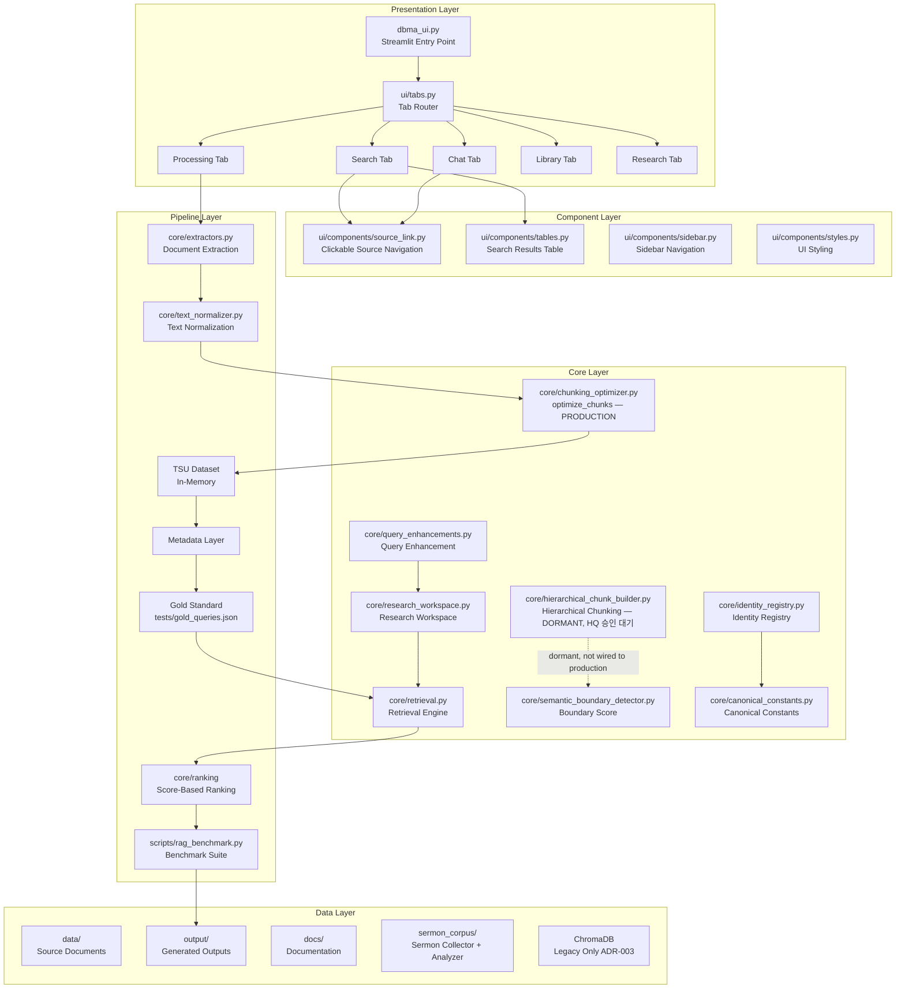

## Data Flow (Mermaid)

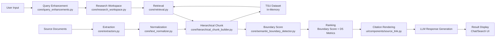

## UI Component Tree (Mermaid)

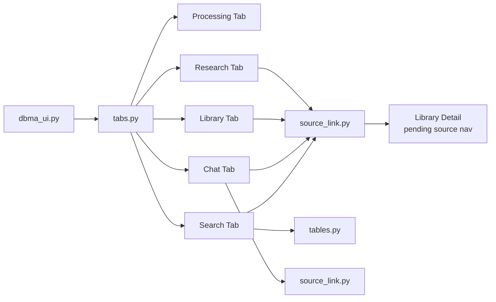

## Core Pipeline Sequence (Mermaid)

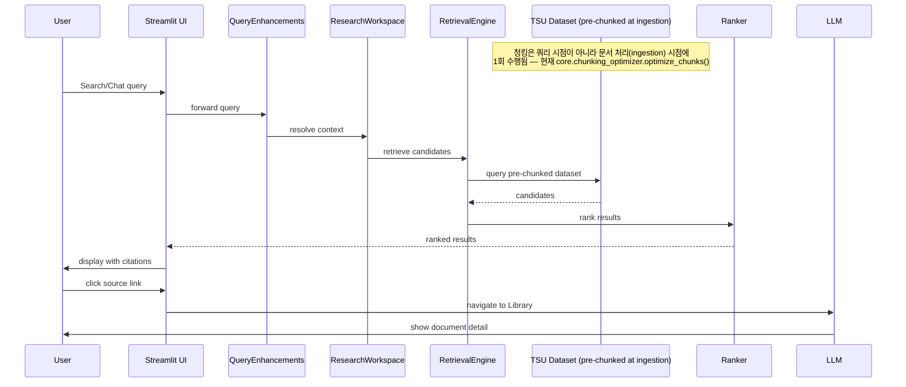

## Key Architecture Decisions (ADR Summary)

| ADR | Topic | Status |
|-----|-------|--------|
| ADR-001 | Retrieval-Engine-Authority | accepted
| ADR-006 | Heading-Provider-Registry | accepted
| ADR-007 | Semantic-Boundary-Detector | accepted
| ADR-008 | Semantic-Chunking-Production-Path | accepted, 프로덕션 전환 경로는 미실행
| ADR-009 | SIL-Theology-Engine | 부분 확정 — 구조만, 신학 어휘/임계값은 별도 승인 대기
| ADR-010 | DBMA-REQ-RAG-Evaluation-Quality | 구조 확정, Phase 1 착수 전 미확정 항목 2건 별도 결정 필요
| ADR-011 | Header-Footer-Repetition-Detector | 완료/보류 확정, 2026-07-23

## Research Workspace Layer (Mermaid)

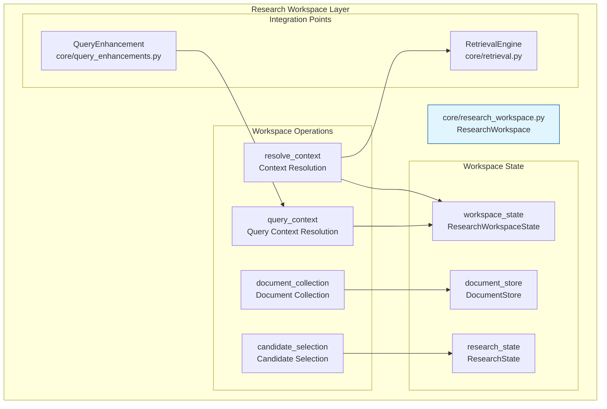

## Boundary Score Model (Mermaid)

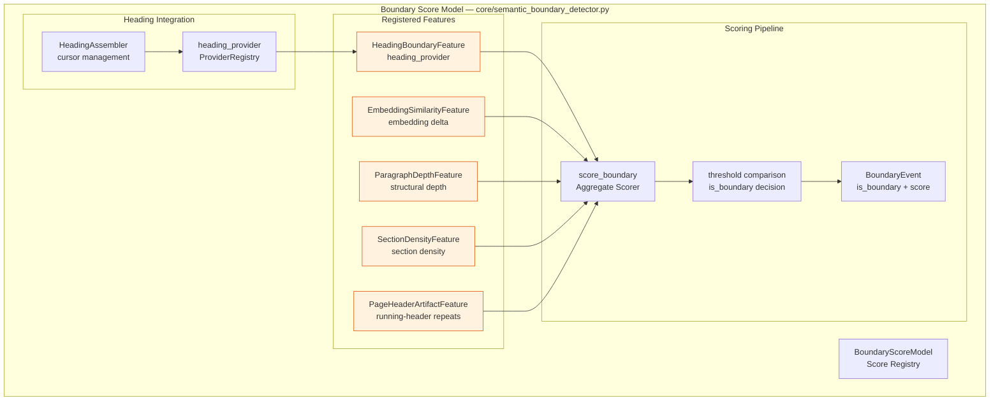

## Hierarchical Chunk Builder (Mermaid)

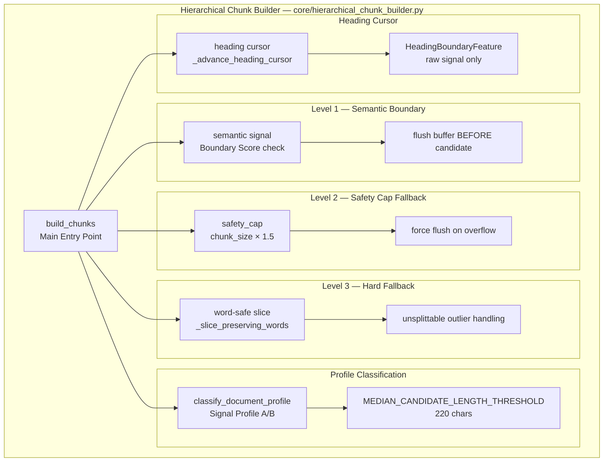

## TLI (Theology Language Intelligence) Architecture (Mermaid)

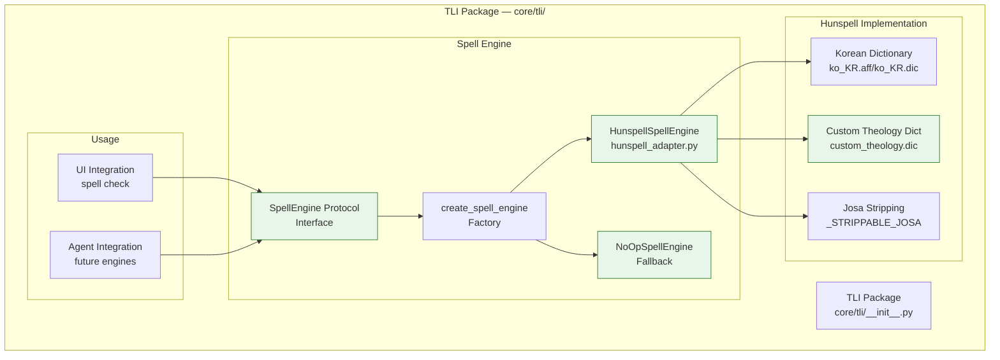

## SIL (Sermon Intelligence Layer) Architecture (Mermaid)

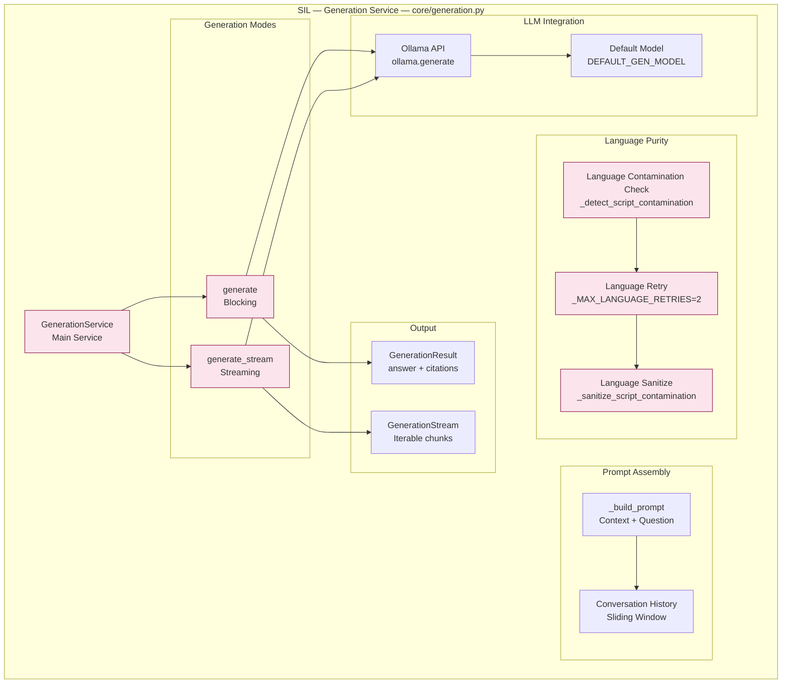

## Complete DBMA Data Flow (Mermaid)

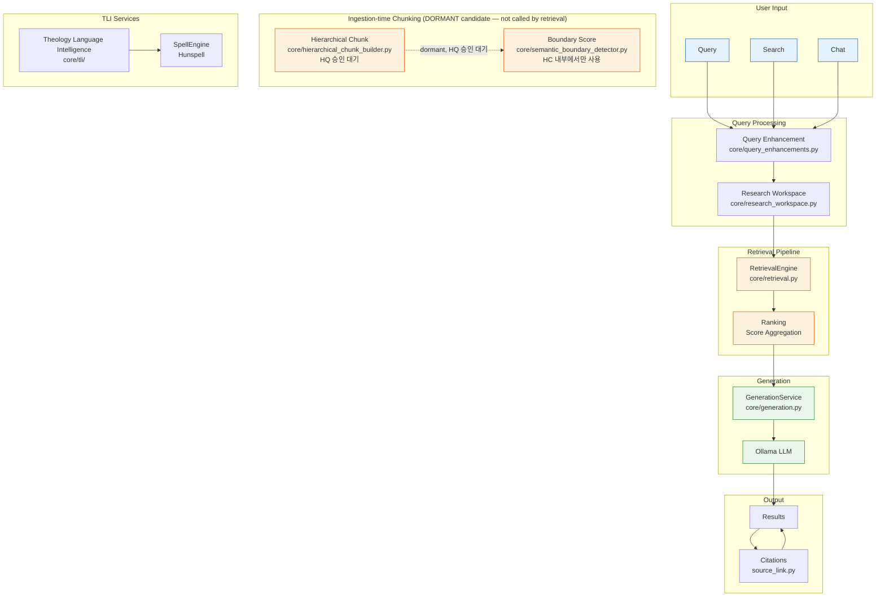

## Project Structure

This diagram represents the current repository structure and file
containment hierarchy. It does not represent runtime dependencies
or execution flow.

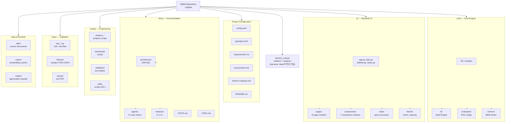

## Current Sprint Reference

For current sprint status, see `docs/STATE.md`

---

*Generated: 2026-07-27*
*Mermaid rendering: VS Code Markdown Preview or GitHub*
