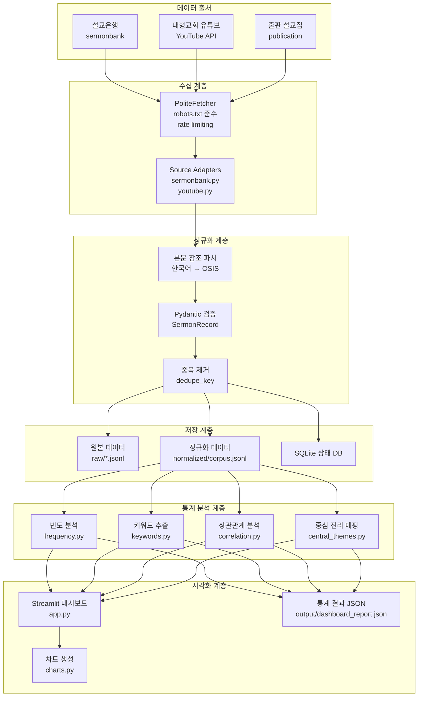
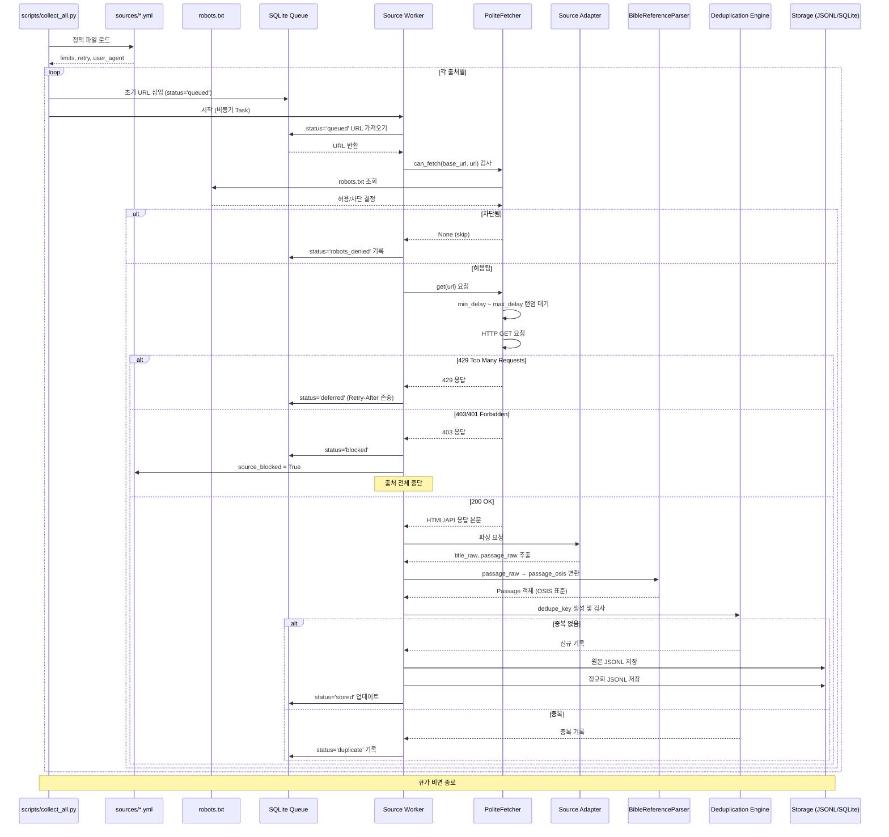
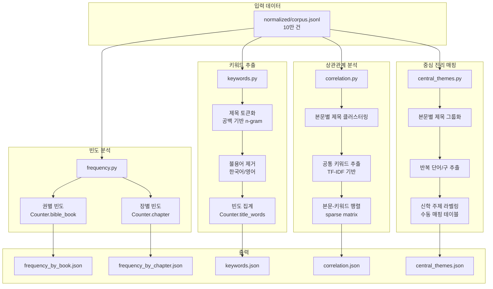
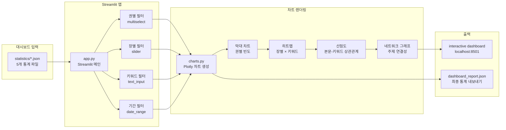
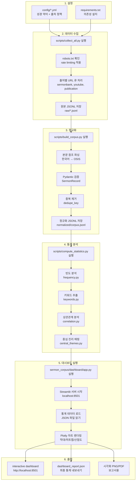
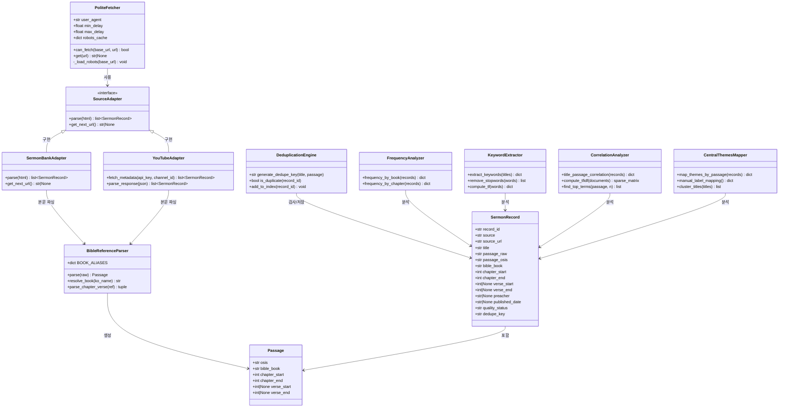

# DBMA 설교 본문-제목 플랫폼 - 플로우차트

## 1. 전체 시스템 아키텍처 흐름



---

## 2. 데이터 수집 파이프라인 상세 흐름



---

## 3. 정규화 및 검증 흐름

```mermaid
flowchart LR
    subgraph "원본 수집"
        A[raw JSONL<br/>title_raw, passage_raw]
    end

    subgraph "본문 참조 파싱"
        B[BibleReferenceParser]
        B1[책명 매핑<br/>한국어 → OSIS]
        B2[장/절 파싱<br/>13:4-7 → chapter/verse]
        B3[범위 확장<br/>단일절 → 시작/끝]
    end

    subgraph "Pydantic 검증"
        C[SermonRecord 검증]
        C1[record_id 고유성]
        C2[source 유효성]
        C3[passage_osis 형식]
        C4[chapter 범위의존성]
    end

    subgraph "중복 제거"
        D[dedupe_key 생성<br/>sha256(title + passage)]
        D1[SQLite에서 중복 검사]
        D2{중복?}
        D2a[예 → skip]
        D2b[아니오 → 저장]
    end

    subgraph "정규화 저장"
        E[normalized/corpus.jsonl]
        F[SQLite 상태 DB]
    end

    A --> B
    B --> B1
    B1 --> B2
    B2 --> B3
    B3 --> C
    C --> C1
    C1 --> C2
    C2 --> C3
    C3 --> C4
    C4 --> D
    D --> D1
    D1 --> D2
    D2a --> D2a
    D2b --> E
    D2b --> F
```

---

## 4. 통계 분석 흐름



---

## 5. 대시보드 시각화 흐름



---

## 6. 전체 실행 흐름 (End-to-End)



---

## 7. 핵심 클래스 관계도



---

## 8. 데이터 흐름 요약

```
┌─────────────┐     ┌──────────────┐     ┌───────────────┐
│  데이터 출처  │ ──▶ │  수집 계층    │ ──▶ │ 정규화 계층    │
│             │     │              │     │               │
│ 설교은행     │     │ PoliteFetcher│     │ 본문 참조 파서 │
│ 유튜브       │     │ Source Adpt  │     │ Pydantic 검증 │
│ 출판 설교집  │     │ robots.txt   │     │ 중복 제거     │
└─────────────┘     └──────────────┘     └───────┬───────┘
                                                  │
                                                  ▼
┌─────────────┐     ┌──────────────┐     ┌───────────────┐
│  시각화 계층 │ ◀── │ 통계 분석 계층 │ ◀── │ 저장 계층     │
│             │     │              │     │               │
│ Streamlit   │     │ 빈도 분석    │     │ 원본 JSONL    │
│ Plotly 차트 │     │ 키워드 추출  │     │ 정규화 JSONL  │
│ 대시보드    │     │ 상관관계 분석│     │ SQLite 상태   │
└─────────────┘     └──────────────┘     └───────────────┘
```

---

*플로우차트 작성일: 2026-07-22*
*버전: 1.0*