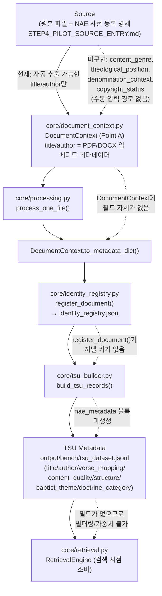

# STEP4 Metadata Flow Diagram

작성일: 2026-07-31
기준: STEP4_PROCESSING_METADATA_FLOW.md 조사 결과를 도식화. 실선 = 현재 코드에 존재하는 경로, 점선 = NAE 확장 시 필요하나 아직 코드에 없는 경로.

## 범례

| 표시 | 의미 |
|---|---|
| 실선 | 현재 코드에서 실제로 동작하는 경로 |
| 점선 | NAE metadata 확장 시 필요하지만, STEP4-A/B 조사 시점 기준 코드에 존재하지 않는 경로 |

## 핵심 관찰

- 파이프라인은 **한 방향 단선 구조**(Source → Registry → Processing 순서가 아니라 실제로는 Source → Processing → Registry → TSU → Retrieval)이며, 어느 한 단계라도 필드를 누락하면 뒤 단계에서 복구 불가 — 이번 조사에서 확인된 실제 순서는 지시서의 "Source→Registry→Processing→TSU" 표기와 다름(processing이 registry보다 먼저 옴)에 유의.
- NAE 필드는 4개 지점(DocumentContext, processing.py 주입부, register_document, build_tsu_records) 전부가 수정되어야 완전히 흐르며, 하나라도 빠지면 그 지점에서 값이 유실됨.
- `Retrieval` 단계는 현재도, NAE 확장 이후에도 **소비만 하고 즉시 영향받지 않음** — additive 필드이므로 검색 로직 변경 없이도 파이프라인 통과 자체는 가능.
